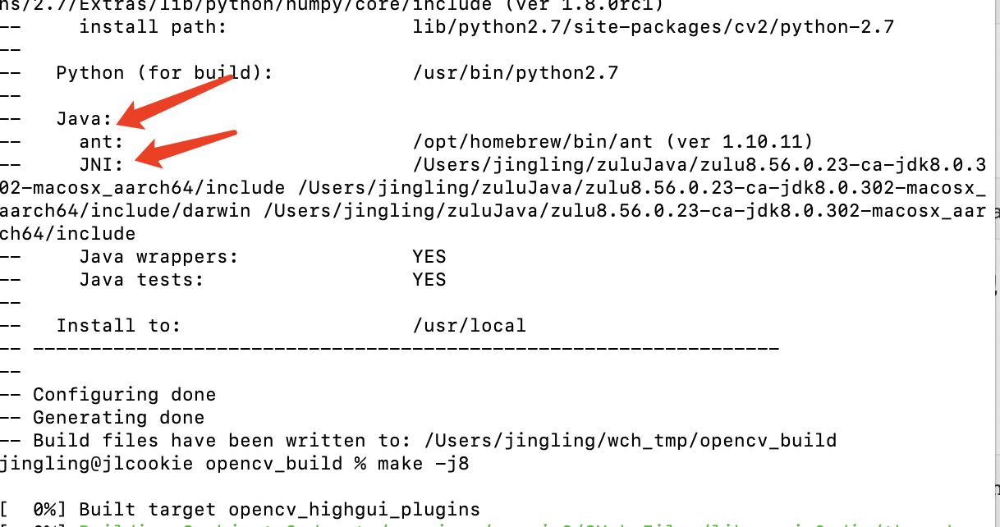

1.安装ant、arm架构jdk

ant:

```
brew install ant
```

Jdk:

```
https://www.azul.com/downloads/?package=jdk
```


2.下载openvc、openvc_contrib源码（需要是同版本的），放到同一目录下

```
https://github.com/opencv/opencv/tags
https://github.com/opencv/opencv_contrib/tags
```


3.安装cmake

```
brew install cmake
```


4.在openvc、openvc_contrib源码同目录创建文件夹

```
mkdir openvc_build
```


5.在shell终端执行语句，声明java环境为arm jdk（需要与后续cmake、make是同一shell）

```
export JAVA_HOME=/Users/jingling/zuluJava/zulu8.56.0.23-ca-jdk8.0.302-macosx_aarch64
```

与后续生成java使用的jar包有关，如果jdk架构与gcc架构不同或jdk环境错误，就无法生成jar包


6.执行cmake，并指定openvc_contrib扩展包位置

```
cmake ../opencv-4.5.3 -DOPENCV_EXTRA_MODULES_PATH=/Users/jingling/wch_tmp/opencv_contrib-4.5.3/modules
```

执行后需要出现以下图片，才会生成java使用的jar包，否则编译不报错但不生成jar包：

ant和JNI都需要有路径，环境错误的情况下值为NO




7.并行编译

```
make -j8
```


8.在build对应文件夹下可以找到文件

```
dylib：./lib/libopencv_java453.dylib
jar：./bin/opencv-453.jar
```


9.看Mac m1使用opencv文档