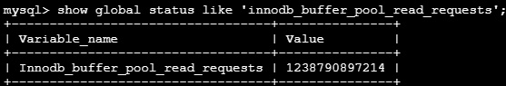
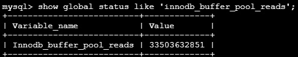
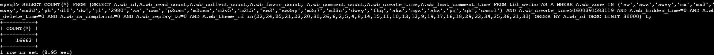
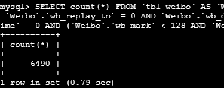
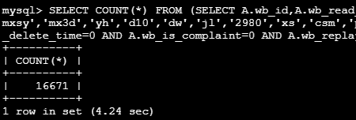
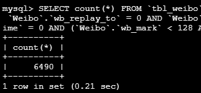
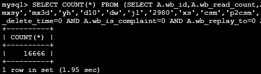

# innodb\_buffer\_pool\_size调整 #

----------
该参数为innodb引擎缓冲池的大小，默认为128M（16K*8192）  
概念：mysql需要操作的所有数据，都需要先从磁盘加载到缓冲池后，才能进行排序、返回给客户端等操作  
生产环境下如果该值过小，会导致频繁发生磁盘读写，影响查询性能  
如果该值过大，可能会因为内存不足报错，最大不超过物理内存的80%
 
----------
## 具体是否需要调整该参数，可以分析缓冲命中率:  

1. 查看从内存中读取逻辑的请求数A  
`show global status like 'Innodb_buffer_pool_read_requests'`

2. 查看从磁盘中读取逻辑的请求数B  
`show global status like 'Innodb_buffer_pool_reads'`  
  
计算内存读取次数占总次数的比例（A/(A+B)），应该大于99%

3. 查看innodb引擎状态  
`show engine innodb status \G`  
  
hit rate应该在950以上，最好是1000/1000

----------

## 以论坛数据库为例，在调整innodb缓冲池大小之前  
查询A耗时9s  
  
查询B耗时0.8s  
  

## 在调整innodb缓冲池大小为1G后
查询A耗时4.2s  
  
查询B耗时0.2s  
  

## 在调整innodb缓冲池大小为8G后
查询A耗时2s  
  
查询B耗时0.2s不变  
  