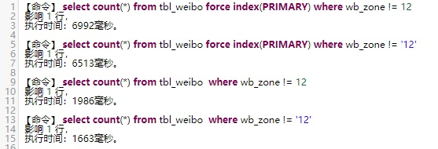

# 提升sql语句的查询速度，需要关注下面几个点   
# 1. 尽量少查数据  
# 2. 尽量少查次数  
# 3. 尽量使用内存，避免使用磁盘（涉及到查数据、排序、临时表）  

----------
## 1. 尽量少查数据  
尽量少查数据，即使用正确的索引，从引擎中查出数据后过滤掉的数据少  
1. sql语句会使用哪个索引，主要看explain分析的key这一列  

2. 使用的索引尽量覆盖where条件中区分度较大的所有字段（如500w数据中有400w+不同值的字段），主要看explain列中的rows（mysql认为需要分析的行数），filtered（查询的行数中有用的比例，100最好）（explain的分析不一定正确，仅供参考）  

3. explain会分析出语句将会使用的索引，但不一定是最优的索引，这取决于rows的大小（优化器认为使用这个索引后还需要扫描的行数），但有时候优化器是错的，必要的时候需要使用`force index(索引名)`来显示指定使用某个索引。如果某两个查出的rows相近，且mysql没有选中最优索引，可以考虑用命令`analyze table 表名`来对索引重新进行分析（会锁表）  

4. 进行分页时，数据量大时，第二条语句会比第一条快很多，因为mysql会先回表再进行limit过滤。第一条语句回表10w条，第二条语句回表100条。

   `SELECT * FROM table WHERE type = 8 LIMIT 100000,100`

   `SELECT * FROM TABLE WHERE id >= (SELECT id FROM table WHERE type = 8 LIMIT 100000,1) AND type = 8 LIMIT 100`

## 2.尽量少查次数
在使用索引的情况下，如果从索引中获得的数据（只包含索引那几列和主键）不能满足该次查询所需的数据（比如需要查询其他列的数据，或根据其他列进行过滤、分组、排序），则会根据查询出的主键再次回表查询数据  
1. 使用explain分析的时候，如果extra栏只有`using index（或using index condition）`，没有`using where`，则没有发生回表操作，如果有`using index（或using index condition）`，也有`using where`，只是有可能发生了回表操作。  
2. （书上写的，没有实践过，书仅介绍至5.5版本，不知后续版本是否有优化）排序时存在两种方式：  
（1）两次传输排序：读取主键和需要排序的字段，对其进行排序，然后再根据排序结果读取所需数据行（需要从引擎读取两次数据，且第二次会产生随机IO）  
（2）单次传输排序：先读取所有需要的列，再根据给定列进行排序（返回的其他列需要占用额外的空间，而这些列对于排序本身没有意义，可能会触发磁盘排序）  
当所需要的列和需要排序的列总大小超过`max_length_for_sort_data`字节，或是这些列中包含text和blob属性的字段，则会使用两次传输排序，否则会使用单次传输排序。  

## 3.尽量使用内存，避免使用磁盘
1. 从内存查数据，少从磁盘查数据  
概念：mysql的所有数据都需要先从磁盘读到内存中，才能进行后续的处理（如返回给客户端、排序、分组等）  
如果一条查询语句A第一次执行耗时明显较久，第二次和第三次执行耗时较短且时长相近（甚至第一次和第二第三次耗时相差几十倍），则可以肯定第一次是从磁盘中加载的数据  
在服务器内存充足的情况下，调大`innodb_pool_buffer_size`的大小（默认仅为128m，生产环境是肯定不够的），避免数据不断被刷出内存，每次查询都要从磁盘读取  
2. 利用内存排序，避免使用磁盘排序  
主要看`Sort_merge_passes`状态字段（查看当前连接状态：`show session status like 'Sort_merge_passes'`）,如果一条语句执行前后，这个字段的值有变动，则说明使用磁盘进行了排序（不同数据量下相同语句得到的结果可能不同，数据量大的环境可能出现磁盘排序）。如果全局状态（`show global status like 'Sort_merge_passes'`）中该参数较高，需要考虑调大`sort_buffer_size`参数（默认为256k，是连接级参数）来避免磁盘排序  
3. 利用内存建立临时表，避免使用磁盘临时表（特别是group by的时候）  
group by 的时候，搜索的数据列中有text和blob属性的字段，如果用到了临时表（explain分析extra字段存在`using temporary`，一般这种情况为group by的字段没用上索引），则一定会使用磁盘临时表，  
所以避免这种写法：`select * from table where a = 1 group by name`  
改为这种：`select * from table t1 join (select id from table i where a = 1 group by name) t2 on t1.id = t2.id`  
分析是否使用了磁盘临时表，主要看`Created_tmp_tables`状态字段：使用临时表的次数，和`Created_tmp_disk_tables`：使用磁盘临时表的次数，这两个状态字段（语句运行前后，当前session的这两个状态值有没有改变）。对于全局来说，如果使用磁盘临时表比值较大（大于5%），则考虑加大`max_heap_table_size`和`tmp_table_size`两个参数的大小（线程级），这两个参数中的最小值会限制临时表的大小

----------

## 其他需要注意的的点  
1. 每条查询（每个SELECT）只会使用一个索引  
2. 对varchar字段使用索引条件搜索时，条件值必须要带''（比如不能是a=12，应该是a='12'），否则可能不走索引，就算走索引，也会比带''慢（估计是mysql处理耗时），下面是测试图：  
    
3. 需要注意最左前缀原则：对于范围条件查询，mysql无法再使用范围列后面的其他索引列，但注意区分什么是范围查询：  
`a > 45`这种是范围查询，无法使用后续索引  
`a in (1,2)`这种是多个等值查询，可以使用后续索引  
4. explain各列参数含义  
id：标识SELECT的编号  
select\_type：对应SELECT是简单还是某种复杂查询  
（1）SIMPLE：简单查询，不包含子查询和UNION  
（2）SUBQUERY：包含在SELECT列表中的子查询中的SELECT（不在FROM子句中）  
（3）DERIVED：包含在FROM子句的子查询中的SELECT，mysql会递归执行并将结果放到一个临时表中  
（4）UNION：在UNION中的第二个和随后的SELECT被标记为UNION  
（5）UNION RESULT：用来从UNION的匿名临时表检索结果的SELECT  
table：表名  
type：访问类型，mysql决定如何查找表中的行，下面依次从最差到最优  
（1）ALL：全表扫描（也有例外，例如使用了LIMIT）  
（2）index：和全表扫描一样，但扫描表时按索引次序而不是行顺序进行，避免了排序。缺点是要承担按索引次序读取整个表的开销  
（3）range：范围扫描，有限制的索引扫描，不用遍历全索引，即where中命中的索引匹配条件是范围查询  
（4）ref：索引查找，返回所有匹配某个单个值的行，即where中命中的索引匹配条件是等于，只有当使用非唯一性索引或者唯一性索引的非唯一性前缀才会发生  
（5）eq\_ref：mysql最多只返回一条符合条件的记录，mysql使用主键或者唯一性索引查找时发生  
（6）const、system：当mysql能对查询的某部分进行优化并将其转换为一个常量时，就会发生  
（7）NULL：  mysql能在优化阶段分解查询语句，在执行阶段甚至不用访问表或者索引。例如从一个索引列中选取最小值  
possible\_keys（重要）：查询可以使用哪些索引  
key（重要）：mysql决定采用哪个索引来进行优化查询，如果该索引没有出现在possible\_keys列中，mysql有可能是基于其他原因选择的索引，例如可能选择了一个覆盖索引，即使没有where语句  
key\_len（重要）：使用索引最大可能的字节数，可以分析出联合索引中哪几个索引有被使用到，如int类型字段占4字节，varchar类型字段根据字符集，utf8字符集1长度占3字节，uft64字符集1长度占4字节  
ref：表在key列中查找值所用的列或常量  
rows：mysql估计为了找到所需的行而需要读取的行数。这一列决定了该条查询mysql会使用哪个索引（行数最少的那个）。如果某两个查出的rows相近，且mysql没有选中最优索引，可以考虑用命令`analyze table 表名`来对索引重新进行分析（会锁表）  
filtered：估算利用索引查出的数据中可用条数的（不会被where条件过滤掉的）占比  
Extra（重要）：额外信息  
（1）Using index：mysql将使用覆盖索引，从索引中获取到的数据（只包含索引那几列和主键）满足当次查询，不需要根据主键再次回表查询  
（2）Using index condition：（需要开启ICP）mysql将使用覆盖索引，覆盖索引中的某些索引无法使用到（如模糊搜索like '%123%'），但依然可以在引擎层对这些数据进行过滤，而不是读取出来后在服务器层过滤  
（3）Using where：意味着可能发生回表操作，mysql将在引擎层读取出数据后再进行过滤（比如where中某列不在选中的索引中）  
（4）Using tmporary：对结果排序时会使用一个临时表  
（5）Using filesort：会对结果使用一个外部索引进行排序，而不是按照索引次序从表中读取行  