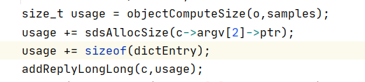
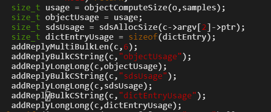
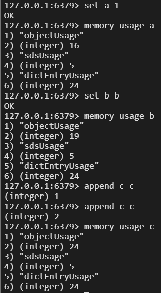
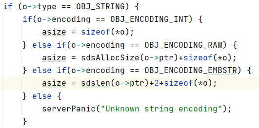
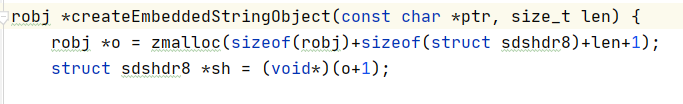

# redis键占用内存思考

## 以下内容在redis4.0版本进行试验

在学习完sds概念后（len、free、flag、buf），又学习了redis string的分类（int、embstr、raw）。看到字符串不为数字且不大于44字节时，使用的编码为embstr。网上说使用embstr时，会直接分配64字节内存（不管字符串实际多长）。那么就有一个问题，书上举的例子（当字符串扩容后，len为13，字符串实际使用的内存应该是13(len)+13(free)+1('\0')=27）是否不合理。或者说，free这个内存预分配的概念，是否与embstr无关，只有使用raw编码的时候才会被用到。然后开始对redis键占用内存进行分析，接触到了`memory usage xxx`命令，发现几种不同的情况：

1.键是string，值是int

```
set a 11
object encoding a = int
memory usage a = 45
```

2.键是string，值是string，且是embstr

```
set a aa
object encoding a = embstr
memory usage a = 48
```

3.键是string，值是string，且是raw

```
set a a
append a a
object encoding a = raw
memory usage a = 53

ps:
接着再append两个字节，memory usage a值是不变的，有了free的概念
```


最开始按照书上的说法，键和值都有对象头，int类型的值占8字节，embstr类型的值占3+1+len字节，无论怎样都无法自圆其说，说明以上三个案例45字节、48字节、53字节是怎么来的。

所以开始看源码：

memory usage命令计算一个键使用的内存大小的源码：

```
void memoryCommand(client *c);
```



可以看出计算分为三个部分：

1.计算值对象占用大小（对象头16字节）

2.计算key使用的sds占用大小（3+1+len+free）

3.计算字典entry占用大小（24字节）


通过修改源码，可以打印出每个部分的字节占用



ps：下载源码并编译的过程如下：

```
wget http://download.redis.io/releases/redis-4.0.9.tar.gz
apt-get install make
apt-get install sysv-rc-conf
apt-get install gcc
tar xf redis-4.0.9.tar.gz -C /usr
cd /usr/redis-4.0.9
make
cd src
make install
```


然后实操查看各部分计算所使用的内存：




至此可以发现，字典entry占用的内存一直都是24，key所使用的sds占用的内存一直是5，改变的只有值对象占用的内存，再接着看值对象内存占用源码：

```
size_t objectComputeSize(robj *o, size_t sample_size);
```




真相大白了，

1.使用int编码的时候，值对象占用大小就是，对象头的大小（16）

2.使用embstr编码的时候，值对象占用大小是，字符串实际长度+2+对象头大小（16）

3.使用raw编码的时候，值对象占用大小是，sds占用内存（3+1+len+free）+对象头大小（16）


至此分析出了`memory usage xxx`计算string键占用内存的原理，但这个内存是否是真正使用的内存呢？比如使用embstr编码的时候，值对象占用大小计算中的+2是什么含义？使用jemalloc分配内存的时候，是否要以2^n字节为单位分配内存？


网上说，不管长度怎样，embstr都分配64字节，从源码看是错误的




感觉使用embstr编码的时候，值对象占用大小计算中的+2是一个bug，使用embstr编码时，redis实际使用的是sdshdr8，是固定存在3个字节的sds头和1个字节的空字符的。

证明了这确实是一个bug，本来embstr想用sdshdr5（头部1个字节），但后来使用了sdshdr8（头部3个字节），所以+2是错误的，正确应该是+4。

具体issue链接：

https://github.com/redis/redis/issues/9258