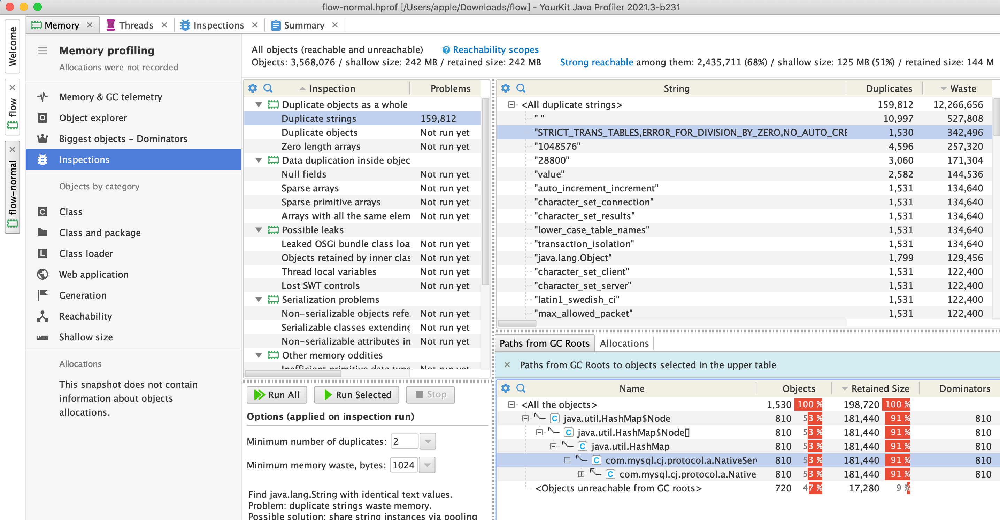
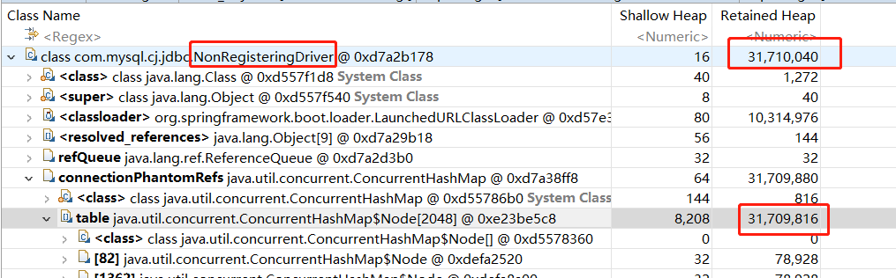
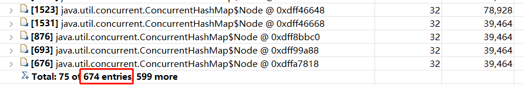
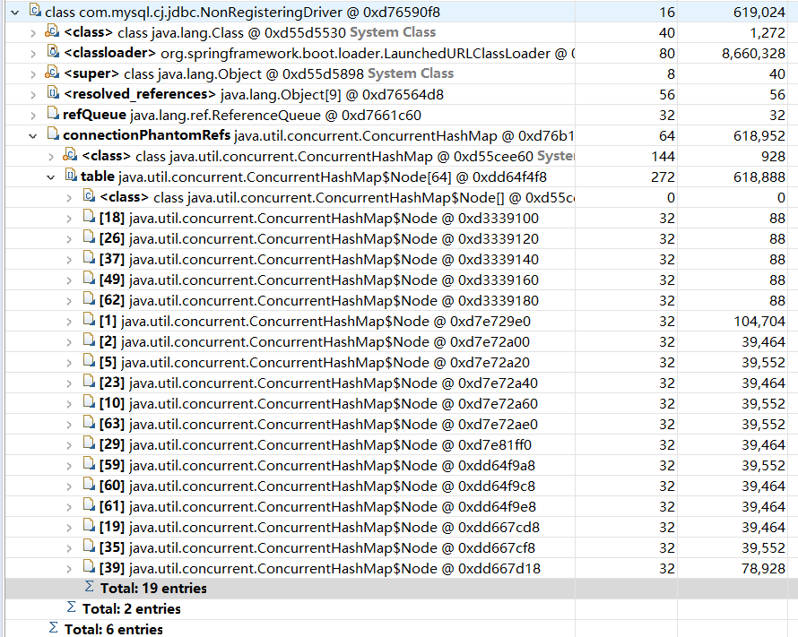
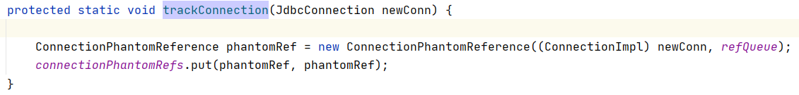
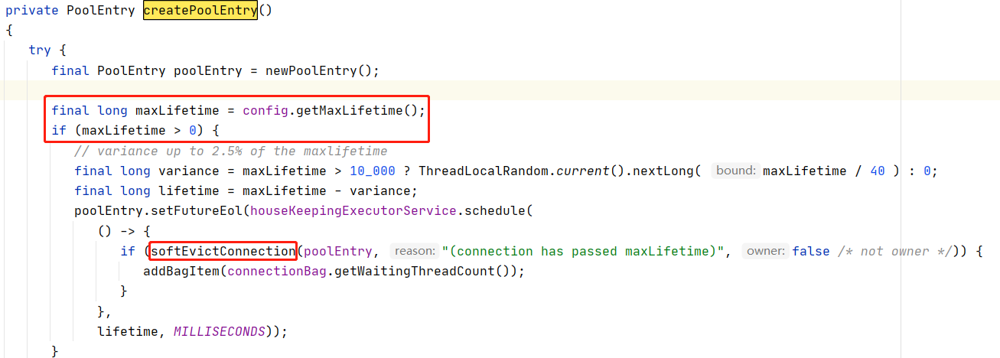
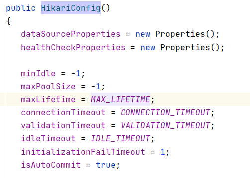
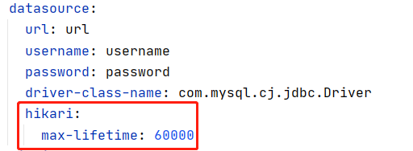
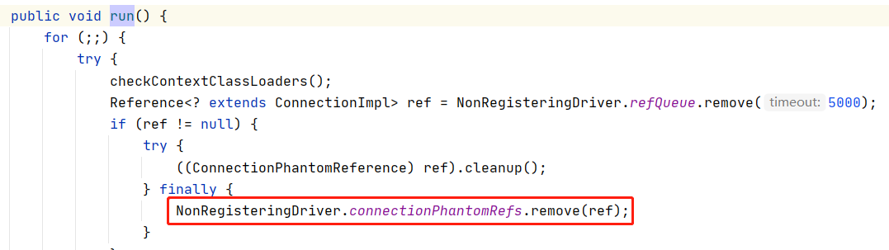

# NonRegisteringDriver内存分析

## 问题描述

存在大量的类似STRICT_TRANS_TABLES...相关的字符串，定位到GC ROOT是NonRegisteringDriver.connectionPhantomRefs




NonRegisteringDriver.connectionPhantomRefs中存储的应该是对数据库连接的引用。在一个运行较久的isc-flow-service进程的dump文件中发现，NonRegisteringDriver对象Retained Heap达到几十m，而其中占用内存的大头就是connectionPhantomRefs中的对象，多达几百个。按理来说数据库连接不可能有那么多个，对此进行分析。

**NonRegisteringDriver Retained Heap：**




**connectionPhantomRefs Entry Count：**




而一个刚刚启动的isc-flow-service进程的dump文件中，NonRegisteringDriver对象并不大。




## 代码排查

connectionPhantomRefs只有一个方法往里放值：

```
com.mysql.cj.jdbc.NonRegisteringDriver#trackConnection
```




往hakari池里创建数据库连接对象的方法

```
com.zaxxer.hikari.pool.HikariPool#createPoolEntry
```



可以看到，有个maxLifetime（最大生存时间，如果该值>0，超过该时间后数据库连接会被销毁，具体的执行方法是sofeEvictConnection）

该值的默认值是30分钟

```
com.zaxxer.hikari.HikariConfig#HikariConfig()
```



可以通过在配置文件设置改变：



到此可以发现，在默认情况下数据库连接每30分钟就会更新一批，旧的连接被销毁，创建新的连接放进池中。

具体的关闭数据库连接的代码为：

```
com.zaxxer.hikari.pool.HikariPool#closeConnection
```


connectionPhantomRefs只有一个方法从里面删除对象：

```
com.mysql.cj.jdbc.AbandonedConnectionCleanupThread#run
```




## 结论

可以在以上代码处打断点，发现数据库连接被关闭时，connectionPhantomRefs并不会立即将该连接移除出去。使用jconsole连接进程，手动触发gc后，发现connectionPhantomRefs会将已关闭的连接移除出去，只剩下存活的连接（默认情况下只有10个）。

所以其实不存在内存泄漏，进程dump的内存中存在大量的字符串、connectionPhantomRefs存在大量的对象，导致NonRegisteringDriver Retained Heap较大，只需一次gc后就能恢复正常。