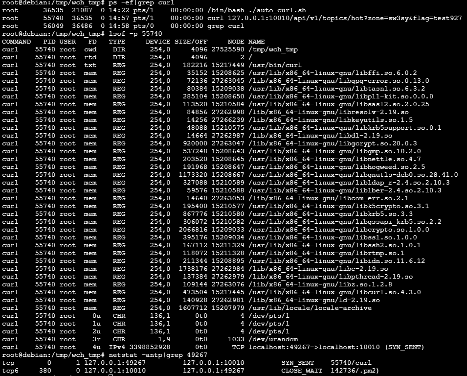

论坛项目三台服务器ABC每一台都有部署前端项目和后端项目，前端项目一般都是调用本机后端项目的接口（请求ip：127.0.0.1），其中C服务器前端项目调用本机后端项目接口经常出现超时。  

----------
经过在服务器C上测试调用1000次接口（请求ip：127.0.0.1）发现，每调150次接口就会出现一次超时（大概70s），而在超时过程中新发起的请求是能够得到正常响应的  
  

----------

针对超时请求的这个curl进程排查发现，curl进程尝试使用端口号1发起SYNC SENT请求，而服务器进程认为端口号1处于CLOSE_WAIT状态，猜测这是导致请求超时的原因（TCP握手失败）
  

----------
查看服务器C的端口状态，发现存在较多的CLOSE_WAIT（且都是与127.0.0.1端口的CLOSE\_WAIT）  
  
而与此同时，服务器A的CLOSE\_WAIT数量仅为1  
  

----------
由此猜测接口超时的原因是：使用127.0.0.1发起请求时，操作系统选中了一个服务进程认为处在CLOSE_WAIT的端口来进行SYNC SENT，从而TCP握手超时，为验证这个猜想，根据不同条件同时使用脚本发起1000次请求  
1. 服务器C上用127.0.0.1发起本机请求（存在超时）  
2. 服务器C上用私网ip（10开头的ip）发起本机请求（无超时）  
3. 服务器A上用私网ip（10开头的ip）发起服务器C的请求（无超时）  
由此最终确认超时问题的根源确实和猜测有关

----------
解决方法有两个：  
1. 前端项目不用127.0.0.1请求本机后端项目，而是用私网ip（10开头的ip）发起请求  
2. 重启服务器C的进程（要看是哪个进程认为端口处于CLOSE\_WAIT，本次是pm2），释放掉CLOSE_WAIT的连接（如果以后因为某种情况服务器C又出现大量CLOSE\_WAIT，服务器C依然会出现超时问题）   

----------
问题猜测：操作系统认为该端口可用，则用该端口建立socket发起连接，而此时服务进程认为与该套接字（本例为127.0.0.1:49267）还处于CLOSE\_WAIT状态，所以拒绝新的tcp握手，而用私网ip发送的请求使用的套接字为（10.:端口号），所以能够正常连接  
即问题是，如果服务进程认为与某套接字（ip:端口号）还处于未断开连接状态，就会拒绝该套接字新的tcp握手（按理来说不会这样，这是CLOSE_WAIT的危害）