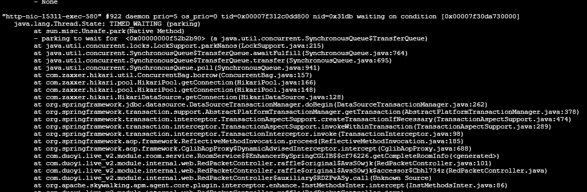

情况概述：直播项目生产环境共有3台业务服A（12核）、B（20核）、C，业务服连接的数据库mysql和redis都在A上，压测使用jmeter进行  
问题描述：生产环境下在业务服B、C进行并发压测，压测结果比测试环境还差，而在业务服A上的压测结果就能达到预期。举例说明：业务服A上某接口压测2000并发时，平均响应时长为500ms左右；同接口在业务服B上压测2000并发时，平均响应时长为8000ms左右。对此问题需要展开排查。  

1.首先猜测是代码问题，代码中存在一些redis的keys操作，怀疑瓶颈在redis（redis单线程，慢查询会导致阻塞），而redis查看慢查询日志，确实能看到一些长达10ms的查询，所以首先对此部分代码进行优化，但优化后效果不尽人意。  
ps:redis查看慢查询日志代码：`slowlog get 128`

----------

2.继续分析该接口代码，发现该接口有2处使用redis进行查询数据的地方，由于redis在业务服A上，且A并发能力较强，所以怀疑业务服B由于查询redis存在网络传输瓶颈（或者连接数不够等），导致业务服B并发能力较弱。于是在业务服B上搭建新的redis用于测试，同时对该接口进行改造，传测试参数时不走从redis获取数据的逻辑。经过测试后，发现业务服B在使用同服redis压测2000并发时，平均响应时长为6000ms左右；业务服B在不使用redis压测2000并发时，平均响应时长在3400ms左右。由此推测出项目连接redis这块确实存在瓶颈：1.网络瓶颈；2.连接数瓶颈。针对连接数瓶颈问题，查看redis客户端连接数，发现只有2个连接。排查项目配置发现，由于配置错误，项目的连接池默认最大并发连接数为8，对该配置进行调整。  
ps:查看某项目连接redis的连接数：  
（1）业务服B上执行`jps`，找到该java项目的进程号  
（2）业务服B上执行`netstat -antp| grep 项目进程号|grep redis端口号|wc -l`  

----------

3.由于业务服B不使用redis压测2000并发时，平均响应时长在3400ms左右，不尽人意，所以需要继续排查。通过`top`命令发现，业务服A在并发高峰时，该项目进程cpu利用率最高能达到1200%，即所有核都在计算  
  
而业务服B在并发高峰时，该项目进程cpu利用率无法突破100%，最高只持续在80%左右（100-2000并发压测，cpu利用率都在80%左右）  
  
所以猜测业务服B是否存在某种限制，限制了单进程的cpu使用率。而后续编写测试函数（循环创建100个线程，循环计算）测试使用cpu资源，发现业务服B资源利用率能达到2000%，即所有核都在计算。而重新部署的一个简单spring boot项目（调用接口直接返回），用于压测时，2000并发平均响应耗时只有30ms，且cpu使用率能达到600%+。就此排除系统限制进程cpu使用率的可能性。同时确定，不是业务服B上项目无法利用cpu资源，而是因为某个地方卡住了，项目没有让cpu去做事。  

----------

4.使用jstack项目的线程堆栈进行分析，通过对比发现，在并发超过200时，业务服A和业务服B上项目的线程数都在400左右；无并发时，线程数都在200左右，即spring在默认情况下对接口的并发处理，最多只会创建200个线程。同时发现，大量的工作线程阻塞在获取数据库连接上，而这是我们万万没有想到的，因为该项目虽然有使用mysql，但只有项目启动时加载一次配置，业务逻辑并不使用mysql。  
  
最后排查代码发现，是service层，在类上标注`@Transactional`标签，导致controller层每次调用service层的方法都会去mysql创建一次事务，即使该次调用与mysql毫无关系  
  

----------

5.在注解掉该事务标签后，项目调用service层方法不再创建事务  
（1）（redis连接数50）业务服B上使用业务服B的redis压测2000并发时，并发平均响应耗时只有300ms左右  
（2）（redis连接数50）业务服B上使用业务服A的redis压测2000并发时，并发平均响应耗时只有2200ms左右  
（3）（redis连接数300）业务服B上使用业务服A的redis压测2000并发时，并发平均响应耗时只有700ms左右  
至此问题解决，业务服B并发主要瓶颈在mysql创建事务，和redis连接数瓶颈上  

----------

ps：在排查问题的过程中，还猜测过以下问题  
（1）项目gc问题。但通过`jstat -gc pid 时间 次数`监控项目gc情况后，发现测试前后gc耗时相差并不大，故排除该可能性  
（2）网络带宽问题。本机（作者本机，非业务服B）压测业务服B时网络传输速度一直只有150KB/s左右，但本机测试从业务服B上下载一个1G+的文件时，网络传输速度可达10MB/s+，故排除该可能性  
（3）业务服B性能瓶颈。但在业务服B上部署两个相同项目同时进行并发压测，平均响应耗时和单个项目进行并发压测相同，故排除该可能性  
（4）cpu存在bug。通过`cat /proc/cpuinfo`发现业务服A上的cpu版本号为7，且不存在bug信息；业务服B上的cpu版本号为1，且存在bug信息。但后来在业务服C（cpu信息与业务服A相同）上测试，发现性能比业务服B好一些（cpu利用率能达到140%），但依然不尽人意。由于对硬件理解不足，该猜测只能搁置。  
（5）jdk存在bug。将业务服A上的jdk复制到业务服B上使用，业务服B性能无提升，故排除该可能性  